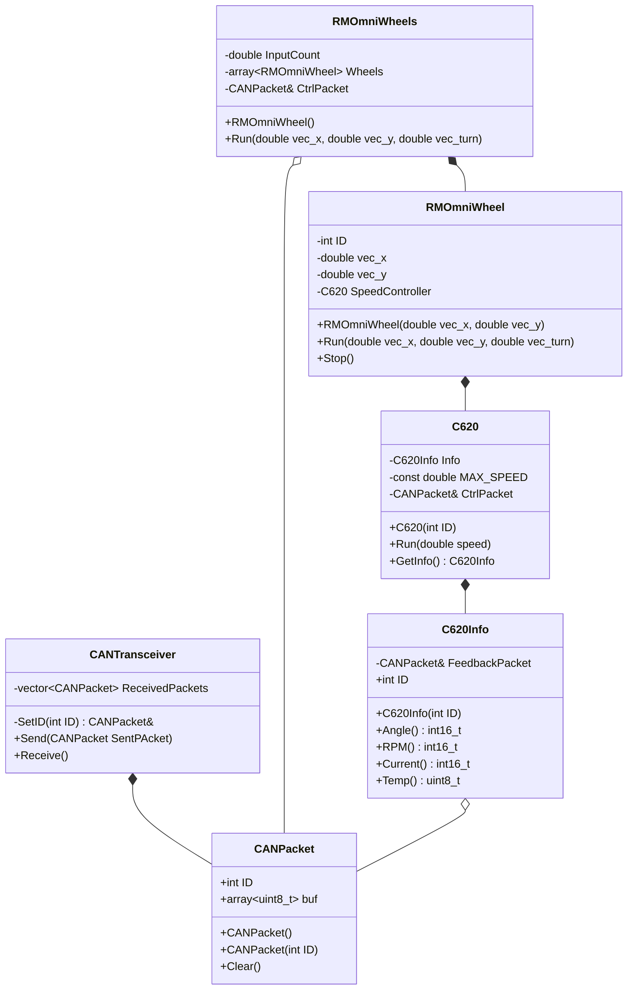

```mermaid
classDiagram
class RMOmniWheels{
    -double InputCount
    -array~RMOmniWheel~ Wheels
    -CANPacket& CtrlPacket
    +RMOmniWheel()
    +Run(double vec_x, double vec_y, double vec_turn)
}
class RMOmniWheel{
    -int ID
    -double vec_x
    -double vec_y
    -C620 SpeedController
    +RMOmniWheel(double vec_x, double vec_y)
    +Run(double vec_x, double vec_y, double vec_turn)
    +Stop()
}
class C620{
    -C620Info Info
    -const double MAX_SPEED
    -CANPacket& CtrlPacket
    +C620(int ID)
    +Run(double speed)
    +GetInfo() C620Info
}
class C620Info{
    -CANPacket& FeedbackPacket
    +int ID
    +C620Info(int ID)
    +Angle() int16_t
    +RPM() int16_t
    +Current() int16_t
    +Temp() uint8_t
}
class CANPacket{
    +int ID
    +array~uint8_t~ buf
    +CANPacket()
    +CANPacket(int ID)
    +Clear()
}
class CANTransceiver{
    -vector~CANPacket~ ReceivedPackets
    -SetID(int ID) CANPacket&
    +Send(CANPacket SentPAcket)
    +Receive()
}

RMOmniWheels *-- RMOmniWheel
RMOmniWheel *-- C620
C620 *-- C620Info
CANTransceiver *-- CANPacket
RMOmniWheels o-- CANPacket
C620Info o-- CANPacket
```