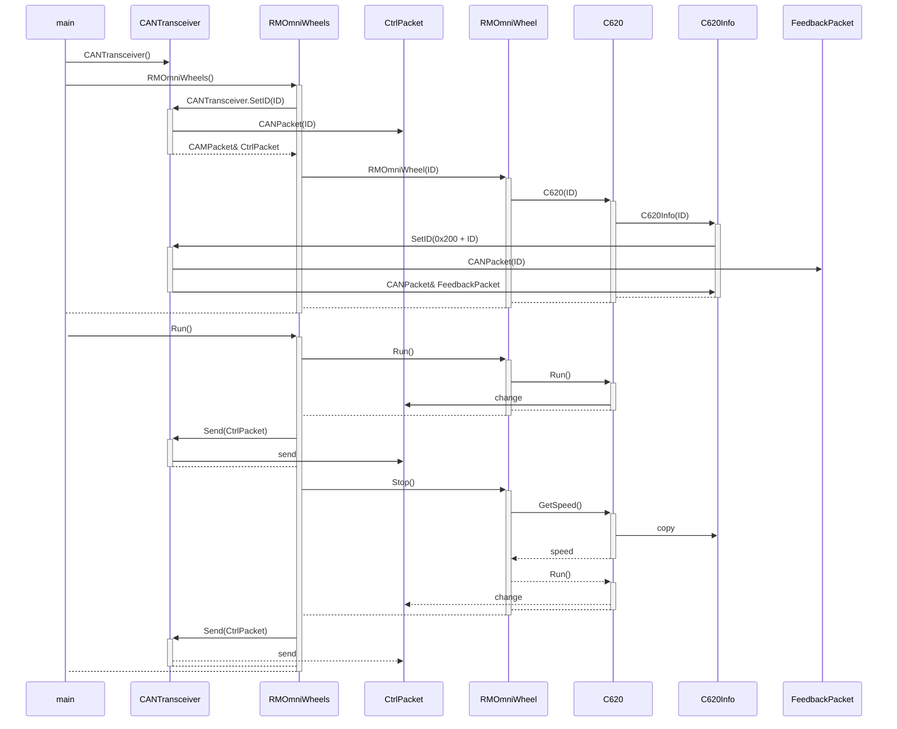

```mermaid
sequenceDiagram
    participant main
    participant CANT as CANTransceiver
    participant RWs as RMOmniWheels
    participant CP as CtrlPacket
    participant RW as RMOmniWheel
    participant 620 as C620
    participant 620i as C620Info
    participant FP as FeedbackPacket
    
    main->>CANT: CANTransceiver()
    main->>+RWs: RMOmniWheels()
    RWs->>+CANT: CANTransceiver.SetID(ID)
    CANT->>CP: CANPacket(ID)
    CANT-->>-RWs: CAMPacket& CtrlPacket
    RWs->>+RW: RMOmniWheel(ID)
    RW->>+620: C620(ID)
    620->>+620i: C620Info(ID)
    620i->>+CANT: SetID(0x200 + ID)
    CANT->>FP: CANPacket(ID)
    CANT->>-620i: CANPacket& FeedbackPacket
    620i-->-620:
    620-->-RW:
    RW-->-RWs:
    RWs-->-main:

    activate main
    main->>+RWs: Run()
    RWs->>+RW: Run()
    RW->>+620: Run()
    620->>CP: change
    620-->-RW:
    RW-->-RWs:
    RWs->>+CANT: Send(CtrlPacket)
    CANT->>CP: send
    CANT-->-RWs:

    RWs->>+RW: Stop()
    RW->>+620: GetSpeed()
    620->>620i: copy
    620-->>-RW: speed
    RW-->>+620: Run()
    620-->>CP: change
    620-->-RW:
    RW-->-RWs:
    RWs->>+CANT: Send(CtrlPacket)
    CANT-->>CP: send
    CANT-->-RWs:
    RWs-->-main:
```